<h2><a href= "https://www.mackenzie.br">Universidade Presbiteriana Mackenzie</a></h2>
<h3><a href= "https://www.mackenzie.br/graduacao/sao-paulo-higienopolis/sistemas-de-informacao">Sistemas de Informação</a></h3>

*Infinityflow*

>*Observação 1: A estrutura inicial deste documento é só um exemplo. O seu grupo deverá alterar esta estrutura de acordo com o que está sendo solicitado na disciplina.*

>*Observação 2: O índice abaixo não precisa ser editado se você utilizar o Visual Studio Code com a extensão **Markdown All in One**. Essa extensão atualiza o índice automaticamente quando o arquivo é salvo.*

**Conteúdo**

- [Autores](#autores)
- [Descrição do projeto](#descrição-do-projeto)
- [Diagrama de casos de uso](#diagrama-de-casos-de-uso)
- [Descrição dos casos de uso](#descrição-dos-casos-de-uso)
- [Protótipos de tela](#protótipos-de-tela)
- [Modelo de domínio](#modelo-de-domínio)
- [Decisões de arquitetura](#decisões-de-arquitetura)
- [Diagrama de implantação](#diagrama-de-implantação)
- [Referências](#referências)

# Autores

* Gabriel de Araujo Martins
* Luana Santos Bueno
* Guilherme Fernandes de Oliveira
* Matheus Felipe Pegorari
* Ricardo de Souza Gava

# Descrição do projeto

*O Infinityflow é um sistemas de presença focado em auxiliar instituições de ensino a gerenciar a lista de presença dos alunos de um jeito fácil e rápido, abdicando da papeladas, pensado para o cenário epidemico e pós epidêmico onde muitos possuiam dificuldade em digitalizar seus cadernos de presença.;*

# Diagrama de casos de uso

Registro de Falta

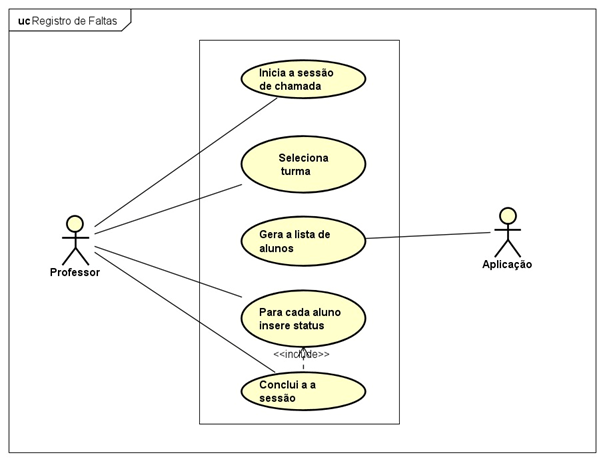

Relatório de Falta

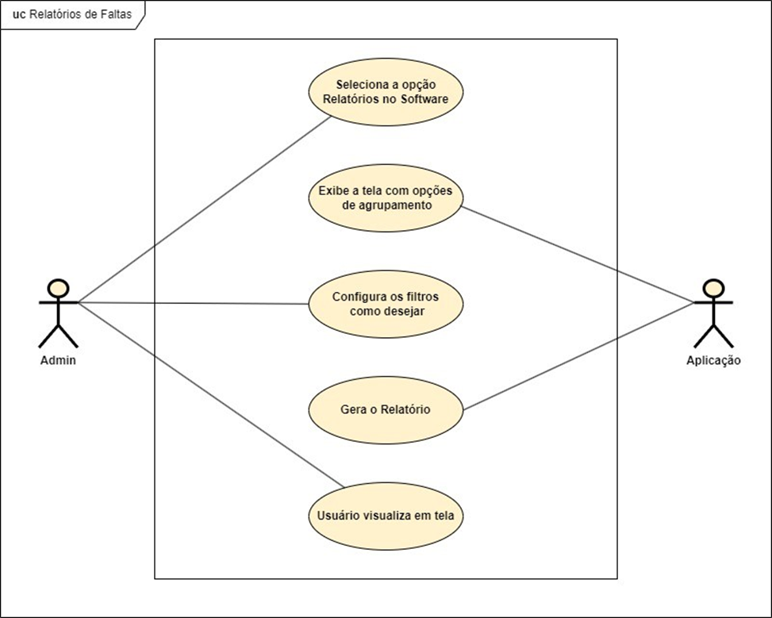

Notificações

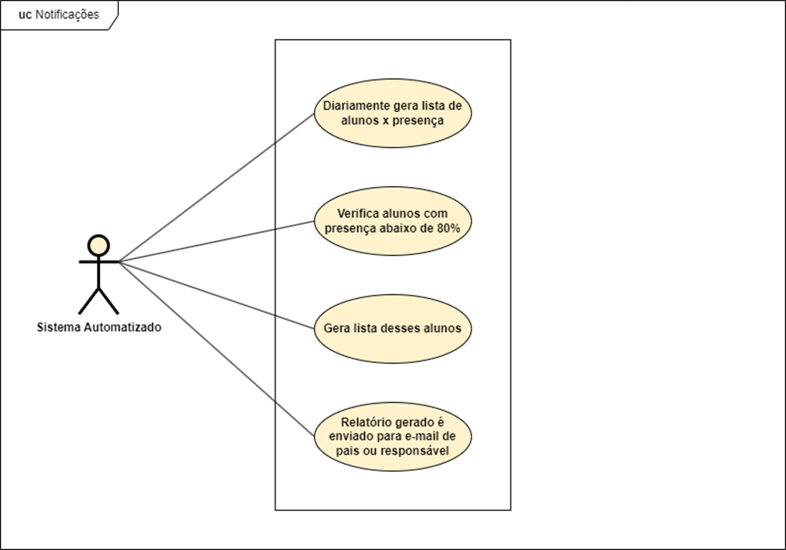

# Descrição dos casos de uso

*   Registro de faltas: permitir que professores registrem faltas de forma fácil e intuitiva.
*   Relatórios de faltas: gerar relatórios de faltas agrupados por data, ano do ensino, turma, professor disciplina ou aluno, para facilitar a análise e o acompanhamento do número de faltas.
*   Notificações: enviar notificações por e-mail para pais ou responsáveis em caso de faltas excessivas (quando a porcentagem de comparecimento às aulas dadas até o momento estiverem abaixo de 80%).*

# Protótipos de tela

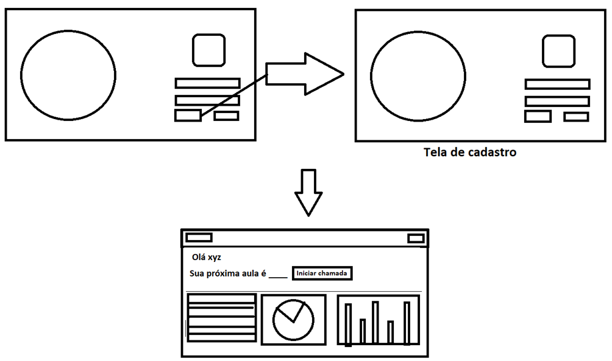

# Modelo de domínio

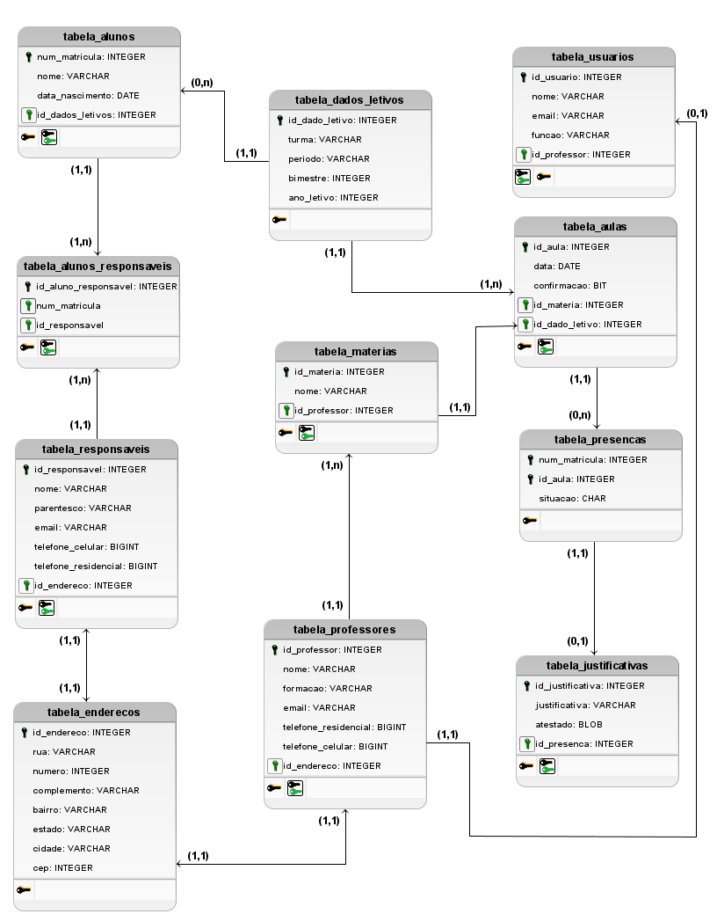

# Decisões de arquitetura

* Arquitetura: VPS (Virtual Private Server) com Ubuntu 22.04

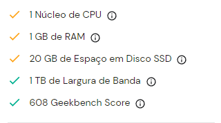

* Dominio: infinityflow.site

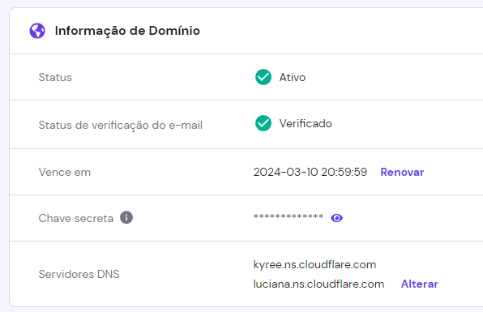

* Certificado SSL: Cloudflare

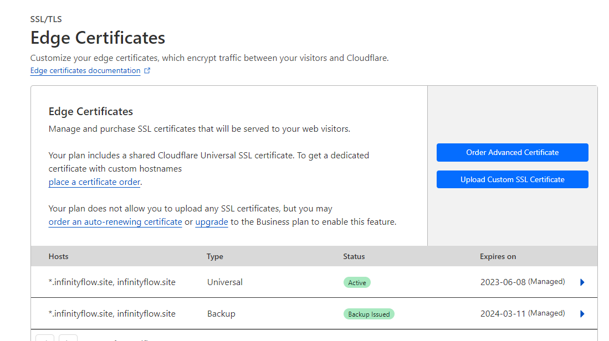

* E-mail para envio: noreply.infinityflow@gmail.com
* CI/CD: Github Actions/Runner

Frontend:
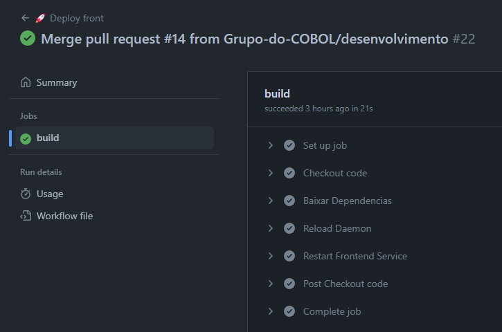

Backend:
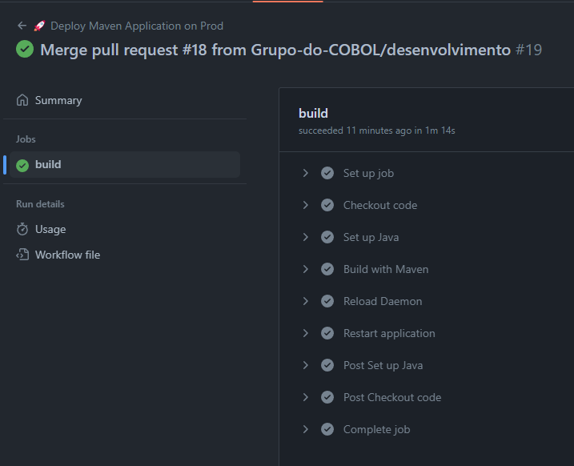

* Banco de dados: MySql

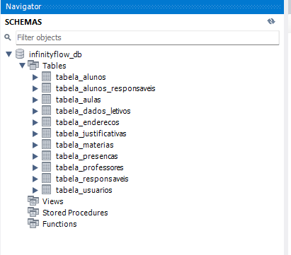

* Backend: Java Spring Boot
* Frontend: Node.js
* Proxy: Apache2
* Portas em uso: 3306, 80, 8080, 3000

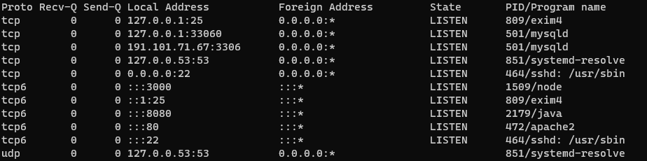

# Diagrama de implantação

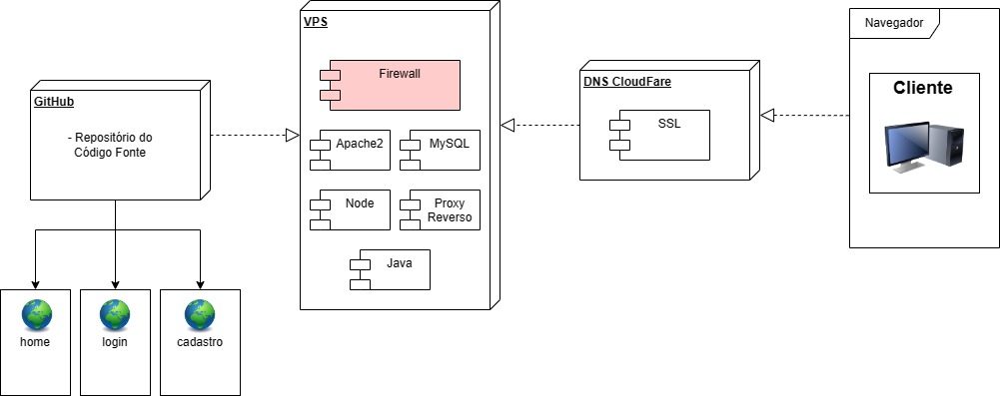

# Referências

* https://stackoverflow.com/
* https://www.hostinger.com.br/
* https://elasticemail.com/
* https://cloudflare.com
